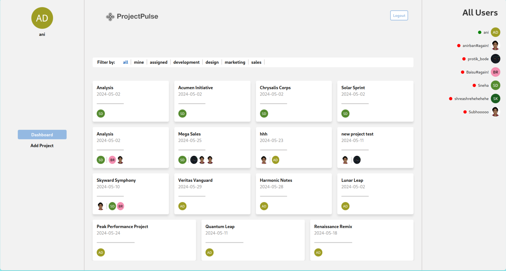
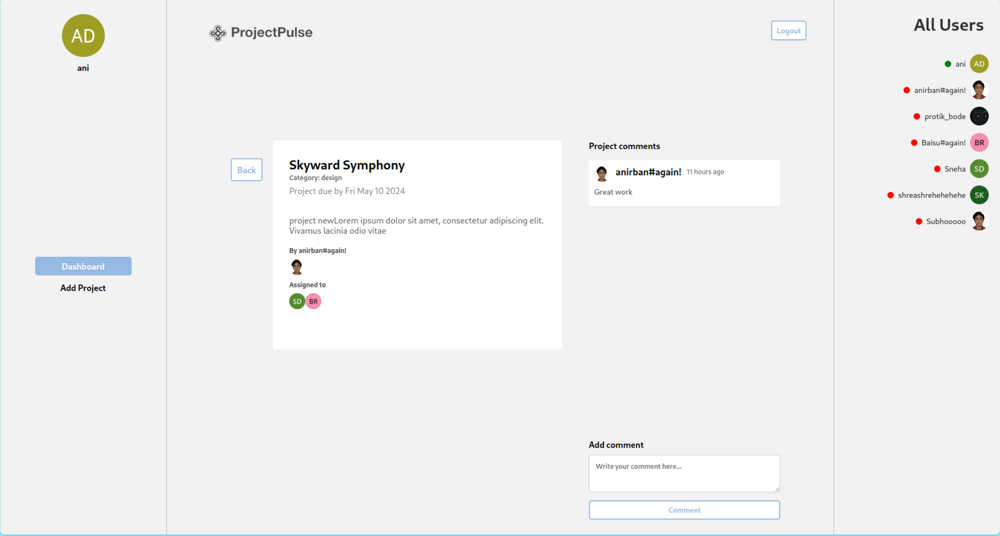
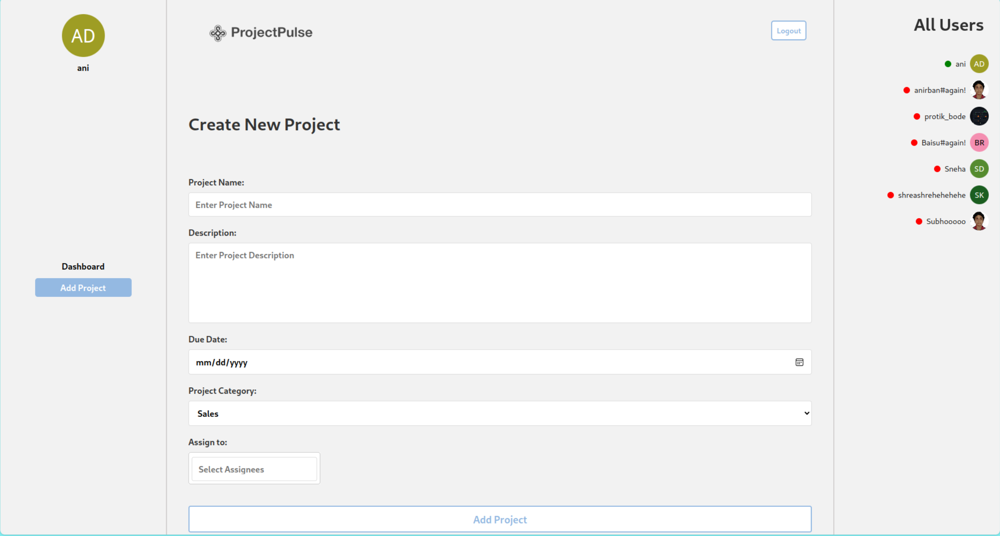

# Project Management System (Frontend)

Welcome to the **Project Management System (Frontend)**! This project is a modern, responsive web application designed to help you manage your projects effectively. Built with React and Vite, it ensures a fast and smooth development experience.

## Table of Contents

- [Project Management System (Frontend)](#project-management-system-frontend)
  - [Table of Contents](#table-of-contents)
  - [Introduction](#introduction)
  - [Features](#features)
  - [Prerequisites](#prerequisites)
  - [Installation](#installation)
  - [Running the Project](#running-the-project)
    - [Screenshots](#screenshots)
  - [Technologies Used](#technologies-used)
    - [Frontend:](#frontend)
    - [Styling:](#styling)
    - [State Management:](#state-management)
    - [Utilities:](#utilities)
  - [Contributing](#contributing)
  - [License](#license)

## Introduction

This Project Management System is designed to provide an intuitive interface for managing projects, tracking progress, and collaborating with team members. With a clean and modern UI, it offers features such as project categorization, filtering, commenting, and user assignments.

## Features

- **Project Filtering:** Filter projects by categories like "All", "Mine", "Assigned", "Development", "Design", "Marketing", and "Sales".
- **Project Details:** View detailed information about each project, including assigned members and comments.
- **Comment System:** Add and view comments on projects to facilitate team collaboration.
- **User Assignments:** See who is assigned to each project and their roles.

## Prerequisites

Ensure you have the following installed on your machine:

- [Node.js](https://nodejs.org/en/) (>= 14.x)
- [Yarn](https://yarnpkg.com/getting-started/install)

## Installation

Follow these steps to get the project up and running on your local machine:

1. **Clone the repository:**

   ```sh
   git clone https://github.com/your-username/project-management-system-frontend.git
   cd project-management-system-frontend 
   ```

2. **Install dependencies:**

    ```sh
    yarn 
    ```
## Running the Project
To start the development server, run:

    
    yarn dev
    
This will start the Vite development server with **HMR** (Hot Module Replacement) enabled. Open your browser and navigate to http://localhost:5173 to see the application in action.


### Screenshots

*Dashboard showing project filters and project cards.*


*Project details view with comments and assigned users.*



*Adding a project*



## Technologies Used
### Frontend:

- [React](https://reactjs.org/)
- [Vite](https://vitejs.dev/)
- [React Router](https://reactrouter.com/)
- [Axios](https://axios-http.com/)


### Styling:

- CSS Modules
- Material-UI

### State Management:

- React Context

### Utilities:

- ESLint
- Prettier

## Contributing

We welcome contributions from the community! To contribute to this project, follow these steps:

1. Fork the repository.
2. Create a new branch (`git checkout -b feature/your-feature`).
3. Commit your changes (`git commit -m 'Add some feature'`).
4. Push to the branch (`git push origin feature/your-feature`).
5. Open a pull request.

Please make sure to follow the contributing guidelines.

## License

This project is licensed under the MIT License. See the [LICENSE](LICENSE) file for details.

Feel free to reach out if you have any questions or need further assistance!